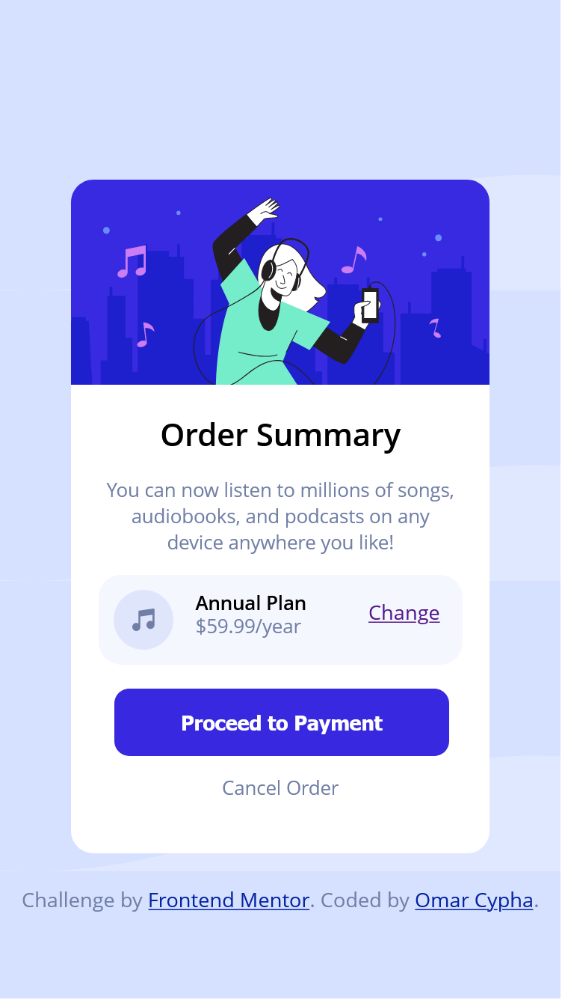
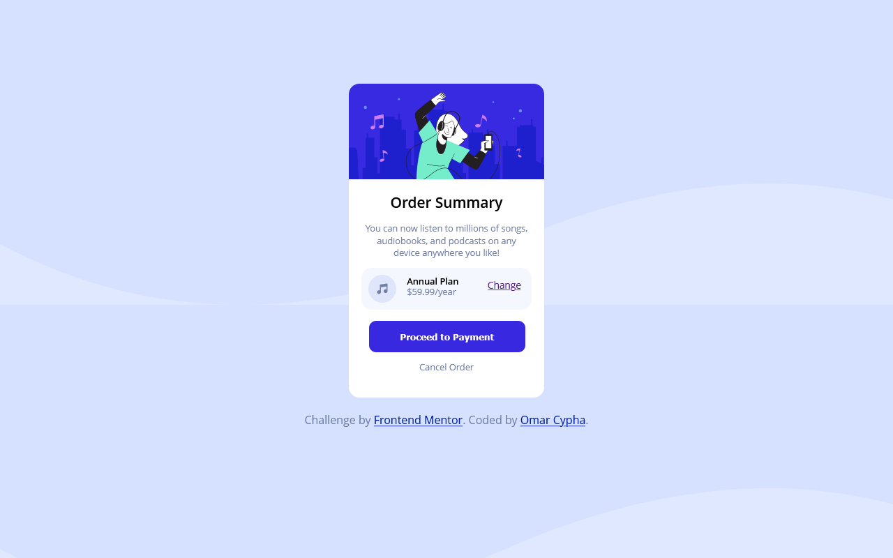

# Frontend Mentor - Order summary card solution

## Welcome! 👋

This is a solution to the [Order summary card challenge on Frontend Mentor](https://www.frontendmentor.io/challenges/order-summary-component-QlPmajDUj). 

## Screenshot

### Mobile View

### Desktop View

### Links

- Solution URL: [Solution](https://github.com/OmarCypha700/order-summary-component)
- Live Site URL: [Live site](https://ordercardsummary.netlify.app)

### Built with

- Semantic HTML5 markup
- CSS custom properties

### Deployed with
- Netlify

## Colors

### Primary

- Pale blue: hsl(225, 100%, 94%)
- Bright blue: hsl(245, 75%, 52%)

### Neutral

- Very pale blue: hsl(225, 100%, 98%)
- Desaturated blue: hsl(224, 23%, 55%)
- Dark blue: hsl(223, 47%, 23%)

### Font

- Family: [Red Hat Display](https://fonts.google.com/specimen/Red+Hat+Display)

**Note:** I will be redesigning these challenges with **Figma** check them out on my [Twitter](https://www.twitter.com/OmarCypha) page.

## Author
- Github - [@Omarcypha700](https://github.com/OmarCypha700)
- Frontend Mentor - [@OmarCypha700](https://www.frontendmentor.io/profile/OmarCypha700)
- Twitter - [@OmarCypha](https://www.twitter.com/OmarCypha)